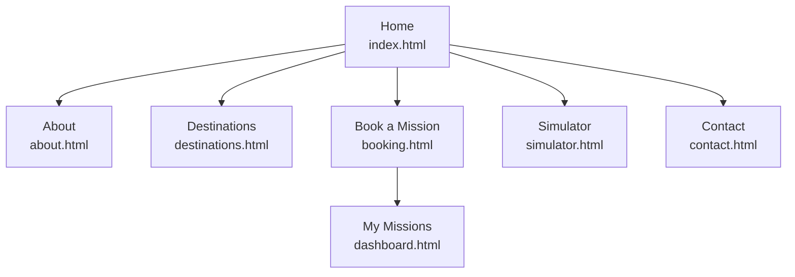
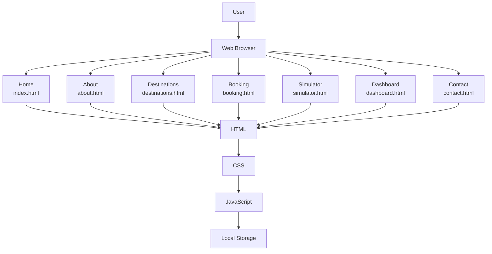

# Clientside-CW2-project
## Development Progress
We're building this project in stages so each of us can work on our own files without conflicts and so we actually understand every part of what we're submitting.
          "Round 1 (complete)"
- Set up the basic HTML structure for home, booking, and simulator pages.
- Got git working across all three of our vs-code and confirmed everyone can push or pull properly.

         "Round 2 (Complete)"
- Added the remaining page structures (About, Destinations, Contact, Dashboard)
- All 7 pages now exists with consistent navigation linking them together

          "Still to come"
- Shared styling (CSS) across all pages
- Add real content and images
- Javascript/jQuery for form validation, the mission simulator, and saving data locally
- Testing everything and writing up our individual reports

We're deliberately going step by step rather than writing everything at once, so each of us can explain our part of the code if asked. 

## Website Flow Diagram

## Astro Launch Expedition - System Architecture

****
